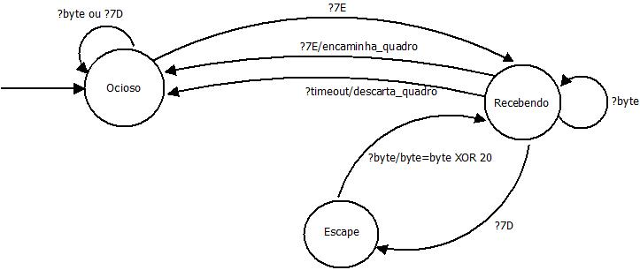

## Tarefa: Modelagem do enquadramento

Utilizando a abordagem de enquadramento denominada Sentinela foi concebida a máquina de estados da Figura abaixo. Nesta técnica de enquadramento há dois tipos de bytes especiais o 7E (*flag*) e o 7D (*escape*) que são utilizados, respectivamente, para indicar inicio/fim de quadro, indicar que no *payload* do quadro existem bytes com o mesmo valor dos bytes especiais. 

Quando, dentro da mensagem, é detectado um byte com o mesmo valor dos bytes especiais o byte passa por um codificação através de uma operação XOR 20. Esse byte codificado será precedido de um byte 7D para informar ao receptor que aquele dado precisará passar por uma nova operação XOR 20 para que a informação original seja recuperada.

